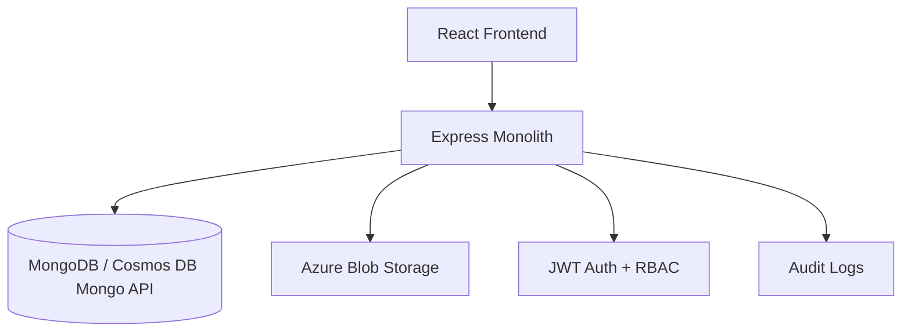

# Insurance Management System

Insurance Management System is a production-ready monolithic application with an Express API, MongoDB or Azure Cosmos DB persistence, Azure Blob document storage, and a React frontend designed for premium enterprise insurance workflows.

## Features

- JWT authentication with `ADMIN` and `USER` roles
- Insurance plan CRUD with active and inactive status control
- Automatic premium calculation by age brackets
- Document upload pipeline with Azure Blob Storage support
- Application workflow with status tracking and admin review
- Admin analytics dashboard with charts and audit logs
- Responsive premium black-and-white UI with dark theme support
- Docker, Azure App Service, and GitHub Actions support

## Architecture Diagram



## Folder Structure

```text
.
|-- backend
|   |-- src
|   |   |-- config
|   |   |-- controllers
|   |   |-- middlewares
|   |   |-- models
|   |   |-- routes
|   |   |-- services
|   |   |-- tests
|   |   |-- utils
|   |   `-- validators
|-- frontend
|   |-- src
|   |   |-- components
|   |   |-- context
|   |   |-- hooks
|   |   |-- pages
|   |   |-- services
|   |   |-- tests
|   |   `-- utils
|-- infra
|-- .github/workflows
|-- Dockerfile
`-- docker-compose.yml
```

## Installation

```bash
git clone <repository-url>
cd Insurance
```

## Environment Variables

Backend variables in `backend/.env.example`:

```env
PORT=5000
MONGODB_URI=mongodb://localhost:27017/insurance-management
COSMOS_DB_URI=
JWT_SECRET=
AZURE_STORAGE_CONNECTION_STRING=
AZURE_CONTAINER_NAME=
CLIENT_URL=http://localhost:5173
NODE_ENV=development
```

Frontend variables in `frontend/.env.example`:

```env
VITE_API_URL=http://localhost:5000/api
```

## Local Setup

Backend development:

```bash
cd backend
npm install
npm run dev
```

Frontend development:

```bash
cd frontend
npm install
npm run dev
```

MongoDB:

```bash
mongod
```

Health check:

```bash
curl http://localhost:5000/api/health
```

## Azure Setup

1. Create Azure Cosmos DB with MongoDB API.
2. Create a Storage Account and Blob container.
3. Build and push the root `Dockerfile` image to your container registry.
4. Deploy the image to Azure App Service.
5. Configure App Service settings with production secrets.
6. Set the Azure App Service Startup Command to `npm start`.

## Cosmos DB Setup

- Use the Azure portal to create a MongoDB API account.
- Copy the primary connection string into `COSMOS_DB_URI`.
- Ensure the database name is `insurance-management` or adjust the URI accordingly.

## Blob Storage Setup

- Create a private blob container named `insurance-documents`.
- Add the connection string to `AZURE_STORAGE_CONNECTION_STRING`.
- Set `AZURE_CONTAINER_NAME=insurance-documents`.

## Docker Setup

```bash
docker build -t insurance-app .
docker-compose up --build
```

## GitHub Actions Setup

- Add `AZURE_CREDENTIALS`, `AZURE_WEBAPP_NAME`, `AZURE_RESOURCE_GROUP`, and `CONTAINER_IMAGE` to GitHub secrets.
- The workflow in `.github/workflows/ci-cd.yml` runs tests, builds the frontend, and updates the App Service container config on `main`.

## API Documentation

Authentication:

- `POST /api/auth/register`
- `POST /api/auth/login`
- `GET /api/auth/profile`

Plans:

- `GET /api/plans`
- `GET /api/plans/:id`
- `POST /api/plans`
- `PUT /api/plans/:id`
- `DELETE /api/plans/:id`

Applications:

- `POST /api/applications`
- `GET /api/applications`
- `GET /api/applications/:id`

Admin:

- `GET /api/admin/dashboard`
- `PUT /api/admin/application/:id/approve`
- `PUT /api/admin/application/:id/reject`

Documents:

- `POST /api/upload`

## Authentication Flow

1. User registers or logs in.
2. API returns a JWT token and user payload.
3. Frontend stores the token in local storage.
4. Axios sends `Authorization: Bearer <token>` on protected requests.
5. Backend middleware enforces RBAC on admin and user routes.

## Screenshots Placeholder

- Landing page
- Admin dashboard
- User dashboard
- Insurance application form

## Troubleshooting

- If uploads return placeholder URLs, set Azure Blob storage credentials.
- If the frontend cannot reach the API, verify `VITE_API_URL`.
- If Cosmos DB is used, confirm the Mongo API connection string includes SSL parameters from Azure.

## Production Deployment

```bash
npm install
npm start
```

Production build command:

```bash
npm run build
```

Azure App Service Startup Command:

```bash
npm start
```

The production server reads `PORT` from the environment, serves the built React app from `frontend/dist` through the Express backend, and does not use `nodemon` in production.

## Security Features

- `helmet`
- `express-rate-limit`
- `cors`
- `bcryptjs`
- `jsonwebtoken`
- `express-mongo-sanitize`
- `xss-clean`
- `multer` file limits and MIME validation
- Joi request validation

## Future Enhancements

- Email and SMS notifications
- Premium quote simulations by dependent coverage inputs
- Payment gateway integration
- Policy renewal reminders

## License

MIT
